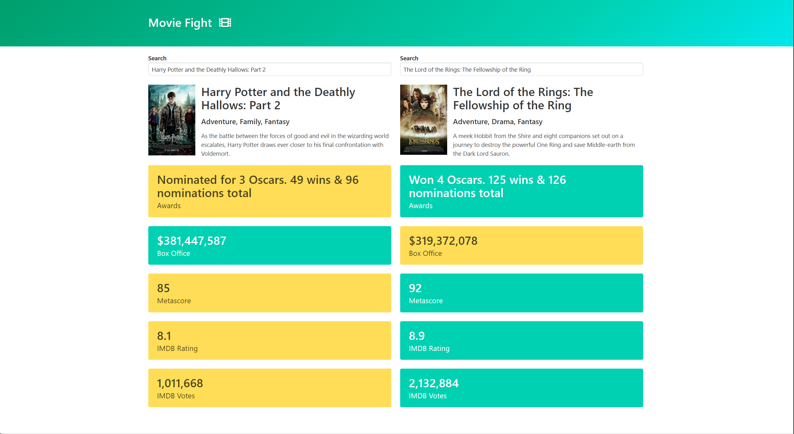

# 🎬 Movie App

Movie Fight is a web application that allows users to **search for two movies** and compare them side by side using data from the [OMDb API](http://www.omdbapi.com/).  
The app highlights statistics such as **Box Office**, **Awards**, **IMDB Rating**, **Metascore**, and more to determine which movie "wins" in each category.

---

## 🚀 Features
- 🔎 **Autocomplete Search**: Search for any movie title.
- 🎥 **Movie Details**: Displays movie poster, genre, plot, and key stats.
- ⚡ **Comparison Mode**: Compares two selected movies side by side.
- 🎨 **Dynamic Highlighting**: Better stats are highlighted for easy comparison.

---

## 🛠️ Tech Stack
- **HTML5**
- **CSS3**
- **JavaScript (ES6)**
- **OMDb API** for movie data

---

## 📸 Preview
Here’s a screenshot of the app in action:




---

## ⚙️ Installation & Setup

1. Clone the repository:
   ```bash
   git clone https://github.com/AnasKhan322/Movie-app
   cd Movie-app
